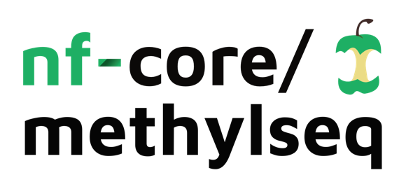

<h1>
  <picture>
    <source media="(prefers-color-scheme: dark)" srcset="docs/images/nf-core-methylseq_logo_dark.png">
    
  </picture>
</h1>

[](https://github.com/nf-core/methylseq/actions/workflows/nf-test.yml)
[](https://github.com/nf-core/methylseq/actions/workflows/linting.yml)[](https://nf-co.re/methylseq/results)[](https://doi.org/10.5281/zenodo.1343417)
[](https://www.nf-test.com)

[](https://www.nextflow.io/)
[](https://github.com/nf-core/tools/releases/tag/3.3.2)
[](https://docs.conda.io/en/latest/)
[](https://www.docker.com/)
[](https://sylabs.io/docs/)
[](https://cloud.seqera.io/launch?pipeline=https://github.com/nf-core/methylseq)

[](https://nfcore.slack.com/channels/methylseq)[](https://bsky.app/profile/nf-co.re)[](https://mstdn.science/@nf_core)[](https://www.youtube.com/c/nf-core)

## Introduction

**nf-core/methylseq** is a bioinformatics analysis pipeline used for Methylation (Bisulfite) sequencing data. It pre-processes raw data from FastQ inputs, aligns the reads and performs extensive quality-control on the results.


The pipeline is built using [Nextflow](https://www.nextflow.io), a workflow tool to run tasks across multiple compute infrastructures in a very portable manner. It uses Docker / Singularity / Podman / Charliecloud / Apptainer containers making installation trivial and results highly reproducible.

On release, automated continuous integration tests run the pipeline on a full-sized dataset on the AWS cloud infrastructure. This ensures that the pipeline runs on AWS, has sensible resource allocation defaults set to run on real-world datasets, and permits the persistent storage of results to benchmark between pipeline releases and other analysis sources.The results obtained from the full-sized test can be viewed on the [nf-core website](https://nf-co.re/methylseq/results).

> Read more about **Bisulfite Sequencing & Three-Base Aligners** used in this pipeline [here](docs/usage/bs-seq-primer.md)

## Pipeline Summary

The pipeline allows you to choose between running either [Bismark](https://github.com/FelixKrueger/Bismark), [bwa-meth](https://github.com/brentp/bwa-meth) / [MethylDackel](https://github.com/dpryan79/methyldackel) or [BWA-Mem](https://github.com/lh3/bwa) plus [rastair](https://bitbucket.org/bsblabludwig/rastair/src/master/) for for TAPS data processing. rastair can also be used with bwa-meth aligned reads by setting the aligner to `--aligner bwameth` and adding the flag `--taps`.

Choose between workflows by using `--aligner bismark` (default, uses bowtie2 for alignment), `--aligner bismark_hisat`, `--aligner bwameth` or `--aligner bwamem`. For higher performance, the pipeline can leverage the [Parabricks implementation of bwa-meth (fq2bammeth)](https://docs.nvidia.com/clara/parabricks/latest/documentation/tooldocs/man_fq2bam_meth.html) and the [Parabricks implementation of bwa-mem (fq2bammemh)](https://docs.nvidia.com/clara/parabricks/latest/documentation/tooldocs/man_fq2bam.html), which implement the baseline tools `bwa-meth` and `bwa-mem`. To use this option, include the `gpu` profile along with `--aligner bwameth` or `--aligner bwamem`.

Note: For faster CPU runs with BWA-Meth, enable the BWA-MEM2 algorithm using `--use_mem2`. The GPU pathway (Parabricks) requires `-profile gpu` and a container runtime (Docker, Singularity, or Podman); Conda/Mamba are not supported for the GPU module.

| Step                                         | Bismark workflow         | bwa-meth workflow     | bwa-mem + TAPS workflow        |
| -------------------------------------------- | ------------------------ | --------------------- | ------------------------------- |
| Generate Reference Genome Index _(optional)_ | Bismark                  | bwa-meth              | bwa index                       |
| Merge re-sequenced FastQ files               | cat                      | cat                   | cat                             |
| Raw data QC                                  | FastQC                   | FastQC                | FastQC                          |
| Adapter sequence trimming                    | Trim Galore!             | Trim Galore!          | Trim Galore!                    |
| Align Reads                                  | Bismark (bowtie2/hisat2) | bwa-meth              | bwa mem                         |
| Deduplicate Alignments                       | Bismark                  | Picard MarkDuplicates | Picard MarkDuplicates           |
| Extract methylation calls                    | Bismark                  | MethylDackel          | TAPS subworkflow (rastair)      |
| Sample report                                | Bismark                  | -                     | -                               |
| Summary Report                               | Bismark                  | -                     | -                               |
| Alignment QC                                 | Qualimap _(optional)_    | Qualimap _(optional)_ | Qualimap _(optional)_           |
| Sample complexity                            | Preseq _(optional)_      | Preseq _(optional)_   | Preseq _(optional)_             |
| Project Report                               | MultiQC                  | MultiQC               | MultiQC                         |

Optional targeted sequencing analysis is available via `--run_targeted_sequencing` and `--target_regions_file`; see the [usage documentation](https://nf-co.re/methylseq/usage) for details.

## Usage

> [!NOTE]
> If you are new to Nextflow and nf-core, please refer to [this page](https://nf-co.re/docs/usage/installation) on how to set-up Nextflow. Make sure to [test your setup](https://nf-co.re/docs/usage/introduction#how-to-run-a-pipeline) with `-profile test` before running the workflow on actual data.

First, prepare a samplesheet with your input data that looks as follows:

`samplesheet.csv`:

```csv
sample,fastq_1,fastq_2,genome
SRR389222_sub1,https://github.com/nf-core/test-datasets/raw/methylseq/testdata/SRR389222_sub1.fastq.gz,,
SRR389222_sub2,https://github.com/nf-core/test-datasets/raw/methylseq/testdata/SRR389222_sub2.fastq.gz,,
SRR389222_sub3,https://github.com/nf-core/test-datasets/raw/methylseq/testdata/SRR389222_sub3.fastq.gz,,
Ecoli_10K_methylated,https://github.com/nf-core/test-datasets/raw/methylseq/testdata/Ecoli_10K_methylated_R1.fastq.gz,https://github.com/nf-core/test-datasets/raw/methylseq/testdata/Ecoli_10K_methylated_R2.fastq.gz,
```

> Each row represents a fastq file (single-end) or a pair of fastq files (paired end).

Now, you can run the pipeline using default parameters as:

```bash
nextflow run nf-core/methylseq --input samplesheet.csv --outdir <OUTDIR> --genome GRCh37 -profile <docker/singularity/podman/shifter/charliecloud/conda/institute>
```

> [!WARNING]
> Please provide pipeline parameters via the CLI or Nextflow `-params-file` option. Custom config files including those provided by the `-c` Nextflow option can be used to provide any configuration _**except for parameters**_; see [docs](https://nf-co.re/docs/usage/getting_started/configuration#custom-configuration-files).

For more details and further functionality, please refer to the [usage documentation](https://nf-co.re/methylseq/usage) and the [parameter documentation](https://nf-co.re/methylseq/parameters).

## Pipeline output

To see the results of an example test run with a full size dataset refer to the [results](https://nf-co.re/methylseq/results) tab on the nf-core website pipeline page.
For more details about the output files and reports, please refer to the [output documentation](https://nf-co.re/methylseq/output).

## Credits

nf-core/methylseq was originally written by Phil Ewels ([@ewels](https://github.com/ewels)), and Sateesh Peri ([@sateeshperi](https://github.com/sateeshperi)) is its active maintainer.

We thank the following people for their extensive assistance in the development of this pipeline:

- Felix Krueger ([@FelixKrueger](https://github.com/FelixKrueger))
- Edmund Miller ([@EMiller88](https://github.com/emiller88))
- Rickard Hammarén ([@Hammarn](https://github.com/Hammarn/))
- Alexander Peltzer ([@apeltzer](https://github.com/apeltzer/))
- Patrick Hüther ([@phue](https://github.com/phue/))
- Maxime U Garcia ([@maxulysse](https://github.com/maxulysse/))

## Contributions and Support

If you would like to contribute to this pipeline, please see the [contributing guidelines](.github/CONTRIBUTING.md).

For further information or help, don't hesitate to get in touch on the [Slack `#methylseq` channel](https://nfcore.slack.com/channels/methylseq) (you can join with [this invite](https://nf-co.re/join/slack)).

## Citations

If you use nf-core/methylseq for your analysis, please cite it using the following doi: [10.5281/zenodo.1343417](https://doi.org/10.5281/zenodo.1343417)

An extensive list of references for the tools used by the pipeline can be found in the [`CITATIONS.md`](CITATIONS.md) file.

You can cite the `nf-core` publication as follows:

> **The nf-core framework for community-curated bioinformatics pipelines.**
>
> Philip Ewels, Alexander Peltzer, Sven Fillinger, Harshil Patel, Johannes Alneberg, Andreas Wilm, Maxime Ulysse Garcia, Paolo Di Tommaso & Sven Nahnsen.
>
> _Nat Biotechnol._ 2020 Feb 13. doi: [10.1038/s41587-020-0439-x](https://dx.doi.org/10.1038/s41587-020-0439-x).
