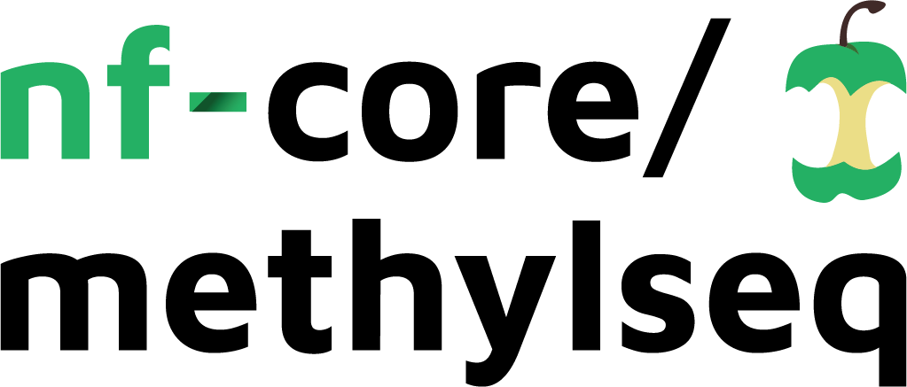

# 

### Introduction

**nf-core/methylseq** is a bioinformatics best-practice analysis pipeline used for Methylation (BS-Seq) data analysis.

The pipeline uses [Nextflow](https://www.nextflow.io), a bioinformatics workflow tool. It pre-processes raw data from FastQ inputs, aligns the reads and performs extensive quality-control on the results.

### Pipeline Steps

The pipeline allows you to choose between running either [Bismark](https://github.com/FelixKrueger/Bismark) or [bwa-meth](https://github.com/brentp/bwa-meth) / [MethylDackel](https://github.com/dpryan79/methyldackel).
Choose between workflows by using `--aligner bismark` (default) or `--aligner bwameth`.

| Step                                         | Bismark workflow | bwa-meth workflow     |
|----------------------------------------------|------------------|-----------------------|
| Generate Reference Genome Index _(optional)_ | Bismark          | bwa-meth              |
| Raw data QC                                  | FastQC           | FastQC                |
| Adapter sequence trimming                    | Trim Galore!     | Trim Galore!          |
| Align Reads                                  | Bismark          | bwa-meth              |
| Deduplicate Alignments                       | Bismark          | Picard MarkDuplicates |
| Extract methylation calls                    | Bismark          | MethylDackel          |
| Sample report                                | Bismark          | -                     |
| Summary Report                               | Bismark          | -                     |
| Alignment QC                                 | Qualimap         | Qualimap              |
| Project Report                               | MultiQC          | MultiQC               |

### Documentation
The nf-core/methylseq pipeline comes with documentation about the pipeline, found in the `docs/` directory:

1. [Installation and configuration](docs/installation.md)
2. [Running the pipeline](docs/usage.md)
3. [Output and how to interpret the results](docs/output.md)

### Credits
These scripts were originally written for use at the [National Genomics Infrastructure](https://portal.scilifelab.se/genomics/) at [SciLifeLab](http://www.scilifelab.se/) in Stockholm, Sweden.

* Main author:
  * Phil Ewels ([@ewels](https://github.com/ewels/))
* Contributors:
  * Rickard Hammarén ([@Hammarn](https://github.com/Hammarn/))
  * Alexander Peltzer ([@apeltzer](https://github.com/apeltzer/))
