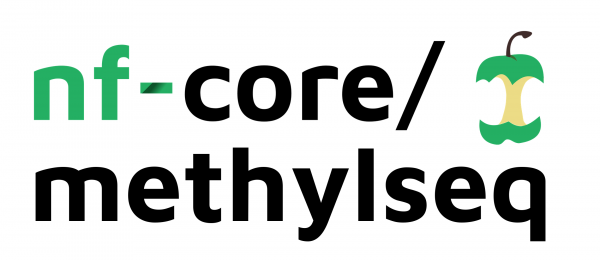

# 

[](https://zenodo.org/badge/latestdoi/124913037)
[](https://github.com/nf-core/methylseq/actions)
[](https://github.com/nf-core/methylseq/actions)
[](https://www.nextflow.io/)

[](http://bioconda.github.io/)
[](https://hub.docker.com/r/nfcore/methylseq/)

nf-core/methylseq is a bioinformatics analysis pipeline used for Methylation (Bisulfite) sequencing data. It pre-processes raw data from FastQ inputs, aligns the reads and performs extensive quality-control on the results.

The pipeline is built using [Nextflow](https://www.nextflow.io), a workflow tool to run tasks across multiple compute infrastructures in a very portable manner. It comes with docker containers making installation trivial and results highly reproducible.

The pipeline allows you to choose between running either [Bismark](https://github.com/FelixKrueger/Bismark) or [bwa-meth](https://github.com/brentp/bwa-meth) / [MethylDackel](https://github.com/dpryan79/methyldackel).
Choose between workflows by using `--aligner bismark` (default, uses bowtie2 for alignment), `--aligner bismark_hisat` or `--aligner bwameth` or `--aligner biscuit`.

| Step                                         | Bismark workflow | bwa-meth workflow     | biscuit           |
|----------------------------------------------|------------------|-----------------------|-------------------|
| Generate Reference Genome Index _(optional)_ | Bismark          | bwa-meth              | biscuit			  |
| Raw data QC                                  | FastQC           | FastQC                | FastQC            |
| Adapter sequence trimming                    | Trim Galore!     | Trim Galore!          | Trim Galore! 	  |
| Align Reads                                  | Bismark          | bwa-meth              | biscuit           |
| Deduplicate Alignments                       | Bismark          | Picard MarkDuplicates | samblaster        |
| Extract methylation calls                    | Bismark          | MethylDackel          | biscuit           |
| Sample Report                                | Bismark          | -                     | biscuit QC        |
| Summary Report                               | Bismark          | -                     | -                 |
| Picard Metrics                               | Picard           | Picard                | Picard            |
| Alignment QC                                 | Qualimap         | Qualimap              | Qualimap          |
| Sample complexity                            | Preseq           | Preseq                | Preseq            |
| Project Report                               | MultiQC          | MultiQC               | MultiQC           |
                                                                                                              
## Quick Start                                                                                                

i. Install [`nextflow`](https://nf-co.re/usage/installation)

ii. Install either [`Docker`](https://docs.docker.com/engine/installation/) or [`Singularity`](https://www.sylabs.io/guides/3.0/user-guide/) for full pipeline reproducibility (please only use [`Conda`](https://conda.io/miniconda.html) as a last resort; see [docs](https://nf-co.re/usage/configuration#basic-configuration-profiles))

iii. Download the pipeline and test it on a minimal dataset with a single command

```bash
nextflow run nf-core/methylseq -profile test,<docker/singularity/conda/institute>
```

> Please check [nf-core/configs](https://github.com/nf-core/configs#documentation) to see if a custom config file to run nf-core pipelines already exists for your Institute. If so, you can simply use `-profile <institute>` in your command. This will enable either `docker` or `singularity` and set the appropriate execution settings for your local compute environment.

iv. Start running your own analysis!

```bash
nextflow run nf-core/methylseq -profile <docker/singularity/conda/institute> --reads '*_R{1,2}.fastq.gz' --genome GRCh37
```

See [usage docs](docs/usage.md) for all of the available options when running the pipeline.

## Documentation

The nf-core/methylseq pipeline comes with documentation about the pipeline, found in the `docs/` directory:

1. [Installation](https://nf-co.re/usage/installation)
2. Pipeline configuration
    * [Local installation](https://nf-co.re/usage/local_installation)
    * [Adding your own system config](https://nf-co.re/usage/adding_own_config)
    * [Reference genomes](https://nf-co.re/usage/reference_genomes)
3. [Running the pipeline](docs/usage.md)
4. [Output and how to interpret the results](docs/output.md)
5. [Troubleshooting](https://nf-co.re/usage/troubleshooting)

## Credits

These scripts were originally written for use at the [National Genomics Infrastructure](https://portal.scilifelab.se/genomics/) at [SciLifeLab](http://www.scilifelab.se/) in Stockholm, Sweden.

* Main author:
  * Phil Ewels ([@ewels](https://github.com/ewels/))
* Contributors:
  * Rickard Hammarén ([@Hammarn](https://github.com/Hammarn/))
  * Alexander Peltzer ([@apeltzer](https://github.com/apeltzer/))
  * Patrick Hüther ([@phue](https://github.com/phue/))

## Contributions and Support

If you would like to contribute to this pipeline, please see the [contributing guidelines](.github/CONTRIBUTING.md).

For further information or help, don't hesitate to get in touch on [Slack](https://nfcore.slack.com/channels/methylseq) (you can join with [this invite](https://nf-co.re/join/slack)).

## Citation

If you use  nf-core/methylseq for your analysis, please cite it using the following doi: [10.5281/zenodo.2555454](https://doi.org/10.5281/zenodo.2555454)

You can cite the `nf-core` publication as follows:

> **The nf-core framework for community-curated bioinformatics pipelines.**
>
> Philip Ewels, Alexander Peltzer, Sven Fillinger, Harshil Patel, Johannes Alneberg, Andreas Wilm, Maxime Ulysse Garcia, Paolo Di Tommaso & Sven Nahnsen.
>
> _Nat Biotechnol._ 2020 Feb 13. doi: [10.1038/s41587-020-0439-x](https://dx.doi.org/10.1038/s41587-020-0439-x).
> ReadCube: [Full Access Link](https://rdcu.be/b1GjZ)
