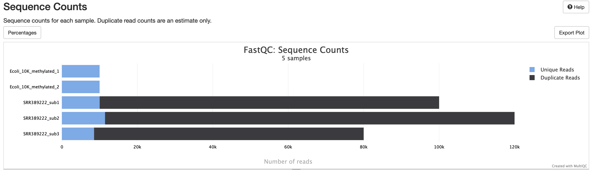

# nf-core/methylseq Output

## Introduction

This document describes the output produced by the pipeline. Most of the plots are taken from the MultiQC report, which summarises results at the end of the pipeline.

Note that nf-core/methylseq contains two workflows - one for Bismark, one for bwa-meth. The results files produced will vary depending on which variant is run.

The output directories listed below will be created in the results directory after the pipeline has finished. All paths are relative to the top-level results directory.

## Pipeline overview

The pipeline is built using [Nextflow](https://www.nextflow.io/) and processes data using the following steps:

- [FastQC](#fastqc) - Raw read QC
- [TrimGalore](#trimgalore) - Adapter trimming
- [Alignment](#alignment) - Aligning reads to reference genome
- [Deduplication](#deduplication) - Deduplicating reads
- [Methylation Extraction](#methylation-extraction) - Calling cytosine methylation steps
- [Bismark Reports](#bismark-reports) - Single-sample and summary analysis reports
- [Qualimap](#qualimap) - Tool for genome alignments QC
- [Preseq](#preseq) - Tool for estimating sample complexity
- [MultiQC](#multiqc) - Aggregate report describing results and QC from the whole pipeline
- [Pipeline information](#pipeline-information) - Report metrics generated during the workflow execution

### FastQC

Output files

- `fastqc/`
  - `*_fastqc.html`: FastQC report containing quality metrics.
  - `*_fastqc.zip`: Zip archive containing the FastQC report, tab-delimited data file and plot images.

[FastQC](http://www.bioinformatics.babraham.ac.uk/projects/fastqc/) gives general quality metrics about your sequenced reads. It provides information about the quality score distribution across your reads, per base sequence content (%A/T/G/C), adapter contamination and overrepresented sequences. For further reading and documentation see the [FastQC help pages](http://www.bioinformatics.babraham.ac.uk/projects/fastqc/Help/).

**NB:** The FastQC plots in this directory are generated relative to the raw, input reads. They may contain adapter sequence and regions of low quality. To see how your reads look after adapter and quality trimming please refer to the FastQC reports in the `trimgalore/fastqc/` directory.

[FastQC](http://www.bioinformatics.babraham.ac.uk/projects/fastqc/) gives general quality metrics about your sequenced reads. It provides information about the quality score distribution across your reads, per base sequence content (%A/T/G/C), adapter contamination and overrepresented sequences. For further reading and documentation see the [FastQC help pages](http://www.bioinformatics.babraham.ac.uk/projects/fastqc/Help/).

## TrimGalore

The nf-core/methylseq pipeline uses [TrimGalore!](http://www.bioinformatics.babraham.ac.uk/projects/trim_galore/) for removal of adapter contamination and trimming of low quality regions. TrimGalore is a wrapper around [Cutadapt](https://github.com/marcelm/cutadapt) and runs FastQC after it finishes.

MultiQC reports the percentage of bases removed by Cutadapt in the _General Statistics_ table, along with a line plot showing where reads were trimmed.

**Output directory: `results/trim_galore`**

Contains FastQ files with quality and adapter trimmed reads for each sample, along with a log file describing the trimming.

- `sample_val_1.fq.gz`, `sample_val_2.fq.gz`
  - Trimmed FastQ data, reads 1 and 2.
  - **NB:** Only saved if `--save_trimmed` has been specified.
- `logs/sample_val_1.fq.gz_trimming_report.txt`
  - Trimming report (describes which parameters that were used)
- `FastQC/sample_val_1_fastqc.zip`
  - FastQC report for trimmed reads

Single-end data will have slightly different file names and only one FastQ file per sample.

### Alignment

Bismark and bwa-meth convert all Cytosines contained within the sequenced reads to Thymine _in-silico_ and then align against a three-letter reference genome. This method avoids methylation-specific alignment bias. The alignment produces a BAM file of genomic alignments.

**Bismark output directory: `results/bismark_alignments/`**
_Note that bismark can use either use Bowtie2 (default) or HISAT2 as alignment tool and the output file names will not differ between the options._

- `sample.bam`
  - Aligned reads in BAM format.
  - **NB:** Only saved if `--save_align_intermeds`, `--skip_deduplication` or `--rrbs` is specified when running the pipeline.
- `logs/sample_PE_report.txt`
  - Log file giving summary statistics about alignment.
- `unmapped/unmapped_reads_1.fq.gz`, `unmapped/unmapped_reads_2.fq.gz`
  - Unmapped reads in FastQ format.
  - Only saved if `--unmapped` specified when running the pipeline.

**bwa-meth output directory: `results/bwa-mem_alignments/`**

- `sample.bam`
  - Aligned reads in BAM format.
  - **NB:** Only saved if `--save_align_intermeds` is used
- `sample.sorted.bam`
  - Aligned reads in a sorted BAM file.
  - **NB:** Only saved if `--save_align_intermeds`, `--skip_deduplication` or `--rrbs` is specified when running the pipeline.
- `sample.sorted.bam.bai`
  - Index of sorted BAM file
  - **NB:** Only saved if `--save_align_intermeds`, `--skip_deduplication` or `--rrbs` is specified when running the pipeline.
- `logs/sample_flagstat.txt`
  - Summary file describing the number of reads which aligned in different ways.
- `logs/sample_stats.txt`
  - Summary file giving lots of metrics about the aligned BAM file.

### Deduplication

This step removes alignments with identical mapping position to avoid technical duplication in the results. Note that it is skipped if `--save_align_intermeds`, `--skip_deduplication` or `--rrbs` is specified when running the pipeline.

**Bismark output directory: `results/bismark_deduplicated/`**

- `deduplicated.bam`
  - BAM file with only unique alignments.
- `logs/deduplication_report.txt`
  - Log file giving summary statistics about deduplication.

**bwa-meth output directory: `results/bwa-mem_markDuplicates/`**

> **NB:** The bwa-meth step doesn't remove duplicate reads from the BAM file, it just labels them.

- `sample.sorted.markDups.bam`
  - BAM file with only unique alignments.
- `sample.sorted.markDups.bam.bai`
  - Index for markDups BAM file.
- `logs/sample.sorted.markDups_metrics.txt`
  - Log file giving summary statistics about deduplication.

### Methylation Extraction

The methylation extractor step takes a BAM file with aligned reads and generates files containing cytosine methylation calls. It produces a few different output formats, described below.

Note that the output may vary a little depending on whether you specify `--comprehensive` or `--non_directional` when running the pipeline.

Filename abbreviations stand for the following reference alignment strands:

- `OT` - original top strand
- `OB` - original bottom strand
- `CTOT` - complementary to original top strand
- `CTOB` - complementary to original bottom strand

**Bismark output directory: `results/bismark_methylation_calls/`**

> **NB:** `CTOT` and `CTOB` are not aligned unless `--non_directional` specified.

- `methylation_calls/XXX_context_sample.txt.gz`
  - Individual methylation calls, sorted into files according to cytosine context.
- `methylation_coverage/sample.bismark.cov.gz`
  - Coverage text file summarising cytosine methylation values.
- `bedGraph/sample.bedGraph.gz`
  - Methylation statuses in [bedGraph](http://genome.ucsc.edu/goldenPath/help/bedgraph.html) format, with 0-based genomic start and 1- based end coordinates.
- `m-bias/sample.M-bias.txt`
  - QC data showing methylation bias across read lengths. See the [bismark documentation](https://rawgit.com/FelixKrueger/Bismark/master/Docs/Bismark_User_Guide.html#m-bias-plot) for more information.
- `logs/sample_splitting_report.txt`
  - Log file giving summary statistics about methylation extraction.

**bwa-meth workflow output directory: `results/MethylDackel/`**

- `sample.bedGraph`
  - Methylation statuses in [bedGraph](http://genome.ucsc.edu/goldenPath/help/bedgraph.html) format.

### Bismark Reports

Bismark generates a HTML reports describing results for each sample, as well as a summary report for the whole run.

**Output directory: `results/bismark_reports`**

**Output directory: `results/bismark_summary`**

## Qualimap

[Qualimap BamQC](http://qualimap.bioinfo.cipf.es/doc_html/analysis.html#bam-qc) is a general-use quality-control tool that generates a number of statistics about aligned BAM files. It's not specific to bisulfite data, but it produces several useful stats - for example, insert size and coverage statistics.

**Output directory: `results/qualimap`**

- `sample/qualimapReport.html`
  - Qualimap HTML report
- `sample/genome_results.txt`, `sample/raw_data_qualimapReport/*.txt`
  - Text-based statistics that can be loaded into downstream programs

## Preseq

[Preseq](http://smithlabresearch.org/software/preseq/) estimates the complexity of a library, showing how many additional unique reads are sequenced for increasing the total read count. A shallow curve indicates that the library has reached complexity saturation and further sequencing would likely not add further unique reads. The dashed line shows a perfectly complex library where total reads = unique reads.

Note that these are predictive numbers only, not absolute. The MultiQC plot can sometimes give extreme sequencing depth on the X axis - click and drag from the left side of the plot to zoom in on more realistic numbers.

**Output directory: `results/preseq`**

- `sample_ccurve.txt`
  - This file contains plot values for the complexity curve, plotted in the MultiQC report.

### MultiQC

:::note
The FastQC plots displayed in the MultiQC report shows _untrimmed_ reads. They may contain adapter sequence and potentially regions with low quality.
:::

### MultiQC

Output files

- `multiqc/`
  - `multiqc_report.html`: a standalone HTML file that can be viewed in your web browser.
  - `multiqc_data/`: directory containing parsed statistics from the different tools used in the pipeline.
  - `multiqc_plots/`: directory containing static images from the report in various formats.

[MultiQC](http://multiqc.info) is a visualization tool that generates a single HTML report summarising all samples in your project. Most of the pipeline QC results are visualised in the report and further statistics are available in the report data directory.

Results generated by MultiQC collate pipeline QC from supported tools e.g. FastQC. The pipeline has special steps which also allow the software versions to be reported in the MultiQC output for future traceability. For more information about how to use MultiQC reports, see <http://multiqc.info>.

### Pipeline information

Output files

- `pipeline_info/`
  - Reports generated by Nextflow: `execution_report.html`, `execution_timeline.html`, `execution_trace.txt` and `pipeline_dag.dot`/`pipeline_dag.svg`.
  - Reports generated by the pipeline: `pipeline_report.html`, `pipeline_report.txt` and `software_versions.yml`. The `pipeline_report*` files will only be present if the `--email` / `--email_on_fail` parameter's are used when running the pipeline.
  - Reformatted samplesheet files used as input to the pipeline: `samplesheet.valid.csv`.
  - Parameters used by the pipeline run: `params.json`.

[Nextflow](https://www.nextflow.io/docs/latest/tracing.html) provides excellent functionality for generating various reports relevant to the running and execution of the pipeline. This will allow you to troubleshoot errors with the running of the pipeline, and also provide you with other information such as launch commands, run times and resource usage.
