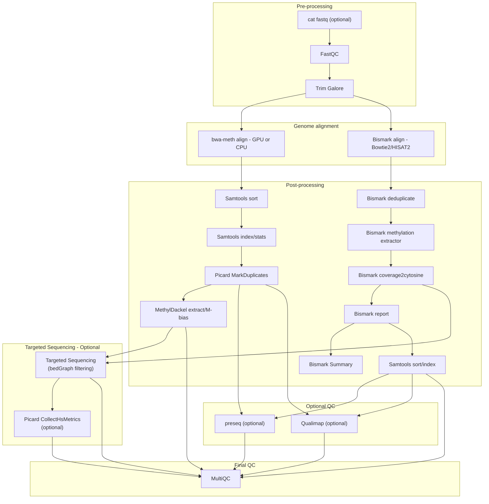

# nf-core/methylseq: Usage

## :warning: Please read this documentation on the nf-core website: [https://nf-co.re/methylseq/usage](https://nf-co.re/methylseq/usage)

> _Documentation of pipeline parameters is generated automatically from the pipeline schema and can no longer be found in markdown files._

## Table of contents

- [Introduction](#introduction)
- [Requirements](#requirements)
- [Workflow: Bismark](#workflow-bismark)
- [Workflow: BWA-Meth](#workflow-bwa-meth)
- [Targeted sequencing (optional)](#targeted-sequencing-optional)
- [Running the pipeline](#running-the-pipeline)
- [Updating the pipeline](#updating-the-pipeline)
- [Reproducibility](#reproducibility)

## Introduction

The nf-core/methylseq pipeline provides two distinct workflows for DNA methylation analysis. These workflows support different aligners and cater to a range of computational requirements.

> Read more about **Bisulfite Sequencing & Three-Base Aligners** used in this pipeline [here](usage/bs-seq-primer.md)

### Requirements

- Nextflow >= 24.10.5
- Container runtime: Docker, Singularity, Podman, Charliecloud, or Apptainer. Conda is also supported for CPU workflows, but the Parabricks GPU pathway does not support Conda/Mamba.



### Workflow: Bismark

By default, the nf-core/methylseq pipeline uses [Bismark](http://www.bioinformatics.babraham.ac.uk/projects/bismark/) with [Bowtie2](http://bowtie-bio.sourceforge.net/bowtie2/index.shtml) as the alignment tool. This configuration is optimized for most DNA methylation workflows and will run unless an alternative aligner is specified.

Starting with Bismark `v0.21.0`, the pipeline also supports [HISAT2](https://ccb.jhu.edu/software/hisat2/index.shtml) as an alternative aligner. To activate this option, use the command-line flag `--aligner bismark_hisat`.

> HISAT2 offers splice-aware alignment, making it suitable for RNA-based analyses (e.g., [SLAMseq](https://science.sciencemag.org/content/360/6390/800) experiments). For such cases, you can supply a file with known splice sites using the `--known_splices` parameter.

### Workflow: BWA-Meth

The second workflow uses [BWA-Meth](https://github.com/brentp/bwa-meth) as the alignment tool and [MethylDackel](https://github.com/dpryan79/methyldackel) for post-processing.

bwa-meth aligner options:

- Standard `bwa-meth` (CPU-based): This option can be invoked via `--aligner bwameth` and uses the traditional BWA-Meth aligner and runs on CPU processors. By default, this uses the standard BWA-MEM algorithm.

- BWA-MEM2 algorithm: For improved performance, you can enable the BWA-MEM2 algorithm by adding `--use_mem2` to your command. BWA-MEM2 is a drop-in replacement for BWA-MEM that is generally faster and more accurate. When enabled, it affects the BWA-Meth CPU workflow (indexing and alignment). The GPU pathway (Parabricks) uses its own implementation and does not use BWA-MEM2.

Examples:

```bash
# Use BWA-Meth with BWA-MEM2 algorithm (CPU)
nextflow run nf-core/methylseq --aligner bwameth --use_mem2 --input samplesheet.csv --genome GRCh38

# Use BWA-Meth with BWA-MEM2 algorithm (GPU)
nextflow run nf-core/methylseq --aligner bwameth --use_mem2 --profile gpu --input samplesheet.csv --genome GRCh38
```

- `Parabricks/FQ2BAMMETH` (GPU-based): For higher performance, the pipeline can leverage the [Parabricks implementation of bwa-meth (fq2bammeth)](https://docs.nvidia.com/clara/parabricks/latest/documentation/tooldocs/man_fq2bam_meth.html), which implements the baseline tool `bwa-meth`. To use this option, include the `gpu` profile (as in `--profile gpu`) along with `--aligner bwameth`.

### Workflow: BWA-Mem

The third workflow uses [BWA-Mem](https://github.com/lh3/bwa) as the alignment tool and [rastair](https://bitbucket.org/bsblabludwig/rastair/src/master/) for post-processing.

bwa-mem aligner options:

- Standard `bwa-mem` (CPU-based): This option can be invoked via `--aligner bwamem` and uses the traditional BWA-Mem aligner and runs on CPU processors.

- `Parabricks/FQ2BAM` (GPU-based): For higher performance, the pipeline can leverage the [Parabricks implementation of bwa-mem (fq2bam)](https://docs.nvidia.com/clara/parabricks/latest/documentation/tooldocs/man_fq2bam.html), which implements the baseline tool `bwa-mem`. To use this option, include the `gpu` profile (as in `--profile gpu`) along with `--aligner bwamem`.

> [!NOTE]
> The Parabricks module does not support Conda/Mamba. Use Docker, Singularity, or Podman.
>
> By default, the Parabricks step requests 100 GB of memory (configurable via process selectors).

### Targeted sequencing (optional)

To run region-focused analysis and optional hybrid-capture metrics:

```bash
nextflow run nf-core/methylseq \
  --input samplesheet.csv \
  --genome GRCh38 \
  --aligner bismark \
  --run_targeted_sequencing \
  --target_regions_file genome_target_regions.bed \
  --collecthsmetrics
```

This filters methylation bedGraphs to the targets and, if `--collecthsmetrics` is set, runs Picard CollectHsMetrics on BAMs using the same targets.

## Samplesheet input

Before running the pipeline, you must create a samplesheet containing information about the samples to be analyzed. Use the appropriate parameter to specify the location of this file.

The samplesheet must be a comma-separated file (CSV) with four columns and a header row, formatted as shown in the examples below:

```bash
--input '[path to samplesheet file]'
```

```csv title="header.csv"
sample,fastq_1,fastq_2,genome
```

### Multiple runs of the same sample

When a `sample` has been re-sequenced multiple times (e.g., to increase sequencing depth), the sample identifiers must remain the same across all runs. This ensures that the pipeline concatenates the raw reads from all runs before proceeding with downstream analysis.

Below is an example where the same sample (single-end) has been sequenced across three lanes:

```csv title="samplesheet.csv"
sample,fastq_1,fastq_2,genome
SRR389222,SRR389222_sub1.fastq.gz,,
SRR389222,SRR389222_sub2.fastq.gz,,
SRR389222,SRR389222_sub3.fastq.gz,,
Ecoli_10K_methylated,Ecoli_10K_methylated_R1.fastq.gz,Ecoli_10K_methylated_R2.fastq.gz,
```

### Full samplesheet

The pipeline automatically detects whether a sample is single- or paired-end based on the information provided in the samplesheet. While additional columns can be included for metadata or other purposes, the first three columns must strictly adhere to the format described in the table below.

A completed samplesheet containing both single- and paired-end data might look like the example below. In this case, the sheet includes six samples, with `TREATMENT_REP3 `sequenced twice:

```csv title="samplesheet.csv"
sample,fastq_1,fastq_2,genome
CONTROL_REP1,AEG588A1_S1_L002_R1_001.fastq.gz,AEG588A1_S1_L002_R2_001.fastq.gz,
CONTROL_REP2,AEG588A2_S2_L002_R1_001.fastq.gz,AEG588A2_S2_L002_R2_001.fastq.gz,
CONTROL_REP3,AEG588A3_S3_L002_R1_001.fastq.gz,AEG588A3_S3_L002_R2_001.fastq.gz,
TREATMENT_REP1,AEG588A4_S4_L003_R1_001.fastq.gz,,
TREATMENT_REP2,AEG588A5_S5_L003_R1_001.fastq.gz,,
TREATMENT_REP3,AEG588A6_S6_L003_R1_001.fastq.gz,,
TREATMENT_REP3,AEG588A6_S6_L004_R1_001.fastq.gz,,
```

| Column    | Description                                                                                                                                                                            |
| --------- | -------------------------------------------------------------------------------------------------------------------------------------------------------------------------------------- |
| `sample`  | Custom sample name. This entry will be identical for multiple sequencing libraries/runs from the same sample. Spaces in sample names are automatically converted to underscores (`_`). |
| `fastq_1` | Full path to FastQ file for Illumina short reads 1. File has to be gzipped and have the extension ".fastq.gz" or ".fq.gz".                                                             |
| `fastq_2` | Full path to FastQ file for Illumina short reads 2. File has to be gzipped and have the extension ".fastq.gz" or ".fq.gz".                                                             |
| `genome`  | Reference genome to be used (OPTIONAL)                                                                                                                                                 |

An [example samplesheet](../assets/samplesheet.csv) has been provided with the pipeline.

## Parameters

Check out the full list of parameters required, available for multiple aligners on [nf-core/methylseq pipeline parameters page](https://nf-co.re/methylseq/parameters/).

- [Input/output options](https://nf-co.re/methylseq/parameters/#input-output-options)
- [Save intermediate files](https://nf-co.re/methylseq/parameters/#save-intermediate-files)
- [Reference genome options](https://nf-co.re/methylseq/parameters/#reference-genome-options)
- [Alignment options](https://nf-co.re/methylseq/parameters/#alignment-options)
- [Special library types](https://nf-co.re/methylseq/parameters/#special-library-types)
- [Adapter Trimming](https://nf-co.re/methylseq/parameters/#adapter-trimming)
- [Bismark options](https://nf-co.re/methylseq/parameters/#bismark-options)
- [bwa-meth options](https://nf-co.re/methylseq/parameters/#bwa-meth-options)
- [Qualimap Options](https://nf-co.re/methylseq/parameters/#qualimap-options)
- [Skip pipeline steps](https://nf-co.re/methylseq/parameters/#skip-pipeline-steps)
- [Run pipeline steps](https://nf-co.re/methylseq/parameters/#run-pipeline-steps)

> It is mandatory to provide `--fasta` along with `--bismark_index`/`--bwameth_index` parameters

## Running the pipeline

The typical command for running the pipeline is as follows:

```bash
nextflow run nf-core/methylseq --input ./samplesheet.csv --outdir ./results --genome GRCh38 -profile docker
```

This will launch the pipeline with the `docker` configuration profile. See below for more information about profiles.

Note that the pipeline will create the following files in your working directory:

```bash
work                # Directory containing the nextflow working files
<OUTDIR>            # Finished results in specified location (defined with --outdir)
.nextflow_log       # Log file from Nextflow
# Other nextflow hidden files, eg. history of pipeline runs and old logs.
```

If you wish to repeatedly use the same parameters for multiple runs, rather than specifying each flag in the command, you can specify these in a params file.

Pipeline settings can be provided in a `yaml` or `json` file via `-params-file <file>`.

> [!WARNING]
> Do not use `-c <file>` to specify parameters as this will result in errors. Custom config files specified with `-c` must only be used for [tuning process resource specifications](https://nf-co.re/docs/usage/configuration#tuning-workflow-resources), other infrastructural tweaks (such as output directories), or module arguments (args).

The above pipeline run specified with a params file in yaml format:

```bash
nextflow run nf-core/methylseq -profile docker -params-file params.yaml
```

with:

```yaml title="params.yaml"
input: './samplesheet.csv'
outdir: './results/'
genome: 'GRCh37'
<...>
```

You can also generate such `YAML`/`JSON` files via [nf-core/launch](https://nf-co.re/launch).

### Providing `ext.args` to Tools

Additional arguments can be appended to a command in a module by specifying them within the module's custom configuration. The configurations for modules and subworkflows used in the pipeline can be found in `conf/modules` or `conf/subworkflows`. A module's publishDir path can also be customized in these configurations.

For example, users working with unfinished genomes containing tens or even hundreds of thousands of scaffolds, contigs, or chromosomes often encounter errors when pre-sorting reads into individual chromosome files.

These errors are typically caused by the operating system's limit on the number of file handles that can be open simultaneously (usually 1024; to find out this limit on Linux, use the command: ulimit -a).

To bypass this limitation, the `--scaffolds` option can be added as an additional `ext.args` in `conf/modules/bismark_methylationextractor.config`.

This prevents methylation calls from being pre-sorted into individual chromosome files.

Instead, all input files are temporarily merged into a single file (unless there is only one file), which is then sorted by both chromosome and position using the Unix sort command.

For a detailed list of different options available, please refer to the official docs of:

- [Bismark](https://felixkrueger.github.io/Bismark/options/genome_preparation/)
- [bwa-meth](https://github.com/brentp/bwa-meth)
- [bwa-mem](https://github.com/lh3/bwa)

### Running the `test` profile

Every nf-core pipeline comes with test data than can be run using `-profile test`. This test profile is useful for testing whether a user's environment is properly setup.

```bash
nextflow run nf-core/methylseq \
  --outdir <OUTDIR> \
  --genome GRCh38 \
  -profile test,<docker/singularity/podman/shifter/charliecloud/conda/institute>
```

### Updating the pipeline

When you run the above command, Nextflow automatically pulls the pipeline code from GitHub and stores it as a cached version. When running the pipeline after this, it will always use the cached version if available - even if the pipeline has been updated since. To make sure that you're running the latest version of the pipeline, make sure that you regularly update the cached version of the pipeline:

```bash
nextflow pull nf-core/methylseq
```

## Reproducibility

It is a good idea to specify the pipeline version when running the pipeline on your data. This ensures that a specific version of the pipeline code and software are used when you run your pipeline. If you keep using the same tag, you'll be running the same version of the pipeline, even if there have been changes to the code since.

First, go to the [nf-core/methylseq releases page](https://github.com/nf-core/methylseq/releases) and find the latest pipeline version - numeric only (eg. `1.3.1`). Then specify this when running the pipeline with `-r` (one hyphen) - eg. `-r 1.3.1`. Of course, you can switch to another version by changing the number after the `-r` flag.

This version number will be logged in reports when you run the pipeline, so that you'll know what you used when you look back in the future. For example, at the bottom of the MultiQC reports.

To further assist in reproducibility, you can use share and reuse [parameter files](#running-the-pipeline) to repeat pipeline runs with the same settings without having to write out a command with every single parameter.

> [!TIP]
> If you wish to share such profile (such as upload as supplementary material for academic publications), make sure to NOT include cluster specific paths to files, nor institutional specific profiles.

## Core Nextflow arguments

> [!NOTE]
> These options are part of Nextflow and use a _single_ hyphen (pipeline parameters use a double-hyphen)

### `-profile`

Use this parameter to choose a configuration profile. Profiles can give configuration presets for different compute environments.

Several generic profiles are bundled with the pipeline which instruct the pipeline to use software packaged using different methods (Docker, Singularity, Podman, Shifter, Charliecloud, Apptainer, Conda) - see below.

> [!IMPORTANT]
> We highly recommend the use of Docker or Singularity containers for full pipeline reproducibility, however when this is not possible, Conda is also supported.

The pipeline also dynamically loads configurations from [https://github.com/nf-core/configs](https://github.com/nf-core/configs) when it runs, making multiple config profiles for various institutional clusters available at run time. For more information and to check if your system is supported, please see the [nf-core/configs documentation](https://github.com/nf-core/configs#documentation).

Note that multiple profiles can be loaded, for example: `-profile test,docker` - the order of arguments is important!
They are loaded in sequence, so later profiles can overwrite earlier profiles.

If `-profile` is not specified, the pipeline will run locally and expect all software to be installed and available on the `PATH`. This is _not_ recommended, since it can lead to different results on different machines dependent on the computer environment.

- `test`
  - A profile with a complete configuration for automated testing
  - Includes links to test data so needs no other parameters
- `docker`
  - A generic configuration profile to be used with [Docker](https://docker.com/)
- `singularity`
  - A generic configuration profile to be used with [Singularity](https://sylabs.io/docs/)
- `podman`
  - A generic configuration profile to be used with [Podman](https://podman.io/)
- `shifter`
  - A generic configuration profile to be used with [Shifter](https://nersc.gitlab.io/development/shifter/how-to-use/)
- `charliecloud`
  - A generic configuration profile to be used with [Charliecloud](https://hpc.github.io/charliecloud/)
- `apptainer`
  - A generic configuration profile to be used with [Apptainer](https://apptainer.org/)
- `wave`
  - A generic configuration profile to enable [Wave](https://seqera.io/wave/) containers. Use together with one of the above (requires Nextflow ` 24.03.0-edge` or later).
- `conda`
  - A generic configuration profile to be used with [Conda](https://conda.io/docs/). Please only use Conda as a last resort i.e. when it's not possible to run the pipeline with Docker, Singularity, Podman, Shifter, Charliecloud, or Apptainer.

### `-resume`

Specify this when restarting a pipeline. Nextflow will use cached results from any pipeline steps where the inputs are the same, continuing from where it got to previously. For input to be considered the same, not only the names must be identical but the files' contents as well. For more info about this parameter, see [this blog post](https://www.nextflow.io/blog/2019/demystifying-nextflow-resume.html).

You can also supply a run name to resume a specific run: `-resume [run-name]`. Use the `nextflow log` command to show previous run names.

### `-c`

Specify the path to a specific config file (this is a core Nextflow command). See the [nf-core website documentation](https://nf-co.re/docs/usage/configuration) for more information.

## Custom configuration

### Resource requests

Whilst the default requirements set within the pipeline will hopefully work for most people and with most input data, you may find that you want to customise the compute resources that the pipeline requests. Each step in the pipeline has a default set of requirements for number of CPUs, memory and time. For most of the pipeline steps, if the job exits with any of the error codes specified [here](https://github.com/nf-core/rnaseq/blob/4c27ef5610c87db00c3c5a3eed10b1d161abf575/conf/base.config#L18) it will automatically be resubmitted with higher resources request (2 x original, then 3 x original). If it still fails after the third attempt then the pipeline execution is stopped.

To change the resource requests, please see the [max resources](https://nf-co.re/docs/usage/configuration#max-resources) and [tuning workflow resources](https://nf-co.re/docs/usage/configuration#tuning-workflow-resources) section of the nf-core website.

### Custom Containers

In some cases, you may wish to change the container or conda environment used by a pipeline steps for a particular tool. By default, nf-core pipelines use containers and software from the [biocontainers](https://biocontainers.pro/) or [bioconda](https://bioconda.github.io/) projects. However, in some cases the pipeline specified version maybe out of date.

To use a different container from the default container or conda environment specified in a pipeline, please see the [updating tool versions](https://nf-co.re/docs/usage/configuration#updating-tool-versions) section of the nf-core website.

### Custom Tool Arguments

A pipeline might not always support every possible argument or option of a particular tool used in pipeline. Fortunately, nf-core pipelines provide some freedom to users to insert additional parameters that the pipeline does not include by default.

To learn how to provide additional arguments to a particular tool of the pipeline, please see the [customising tool arguments](https://nf-co.re/docs/usage/configuration#customising-tool-arguments) section of the nf-core website.

```console
Command error:
    .command.sh: line 9:  30 Killed    STAR --genomeDir star --readFilesIn WT_REP1_trimmed.fq.gz --runThreadN 2 --outFileNamePrefix WT_REP1. <TRUNCATED>
Work dir:
    /home/pipelinetest/work/9d/172ca5881234073e8d76f2a19c88fb

Tip: you can replicate the issue by changing to the process work dir and entering the command `bash .command.run`
```

#### Resource Limits

In addition to the executor, you may find that pipeline runs occasionally fail due to a particular step of the pipeline requesting more resources than you have on your system.

To avoid these failures, you can tell Nextflow to set a cap pipeline-step resource requests against a list called `resourceLimits` specified in Nextflow config file. These should represent the maximum possible resources of a machine or node.

Specify the maximum resources that can be used (cpus, memory, time) for all processes by default or for a specific process using `withName` or `withLabel` selectors as shown below:

> Global resource limits

```
process {
    resourceLimits = [
        cpus: 4,
        memory: '15.GB',
        time: '1.h'
    ]
}
```

> Process-specific resource limits

```
process {
  withName: 'BISMARK_ALIGN' {
    resourceLimits = [
        cpus: 4,
        memory: '15.GB',
        time: '1.h'
    ]
  }
}
```

#### Advanced option on process level

We have standardised the structure of Nextflow DSL2 pipelines such that all module files will be present in the `modules/` directory and so, based on the search results, the file we want is `modules/nf-core/bismark/align/main.nf`.

In the module `main.nf`, you will notice that there is a `label` directive at the top of the module that is set to `label process_high`.

The [Nextflow `label`](https://www.nextflow.io/docs/latest/process.html#label) directive allows us to organize workflow processes in separate groups which can be referenced in a configuration file to select and configure subset of processes having similar computing requirements.

The default values for the `process_high` label are set in the pipeline's [`base.config`](https://github.com/nf-core/methylseq/blob/master/conf/base.config) which in this case is defined as `72.GB`.

Providing you haven't set any other standard nf-core parameters to **cap** the [resource limits](https://www.nextflow.io/docs/latest/reference/process.html#resourcelimits) used by the pipeline then we can try and bypass the `BISMARK_ALIGN` process failure by creating a custom config file that sets at least `72.GB` of memory, in this case increased to `100.GB`.

The custom config below can then be provided to the pipeline via the [`-c`](#-c) parameter as highlighted in previous sections.

```nextflow
process {
  withName: 'BISMARK_ALIGN' {
    memory = 100.GB
  }
}
```

### Updating containers (advanced users)

The [Nextflow DSL2](https://www.nextflow.io/docs/latest/dsl2.html) implementation of this pipeline uses one container per process which makes it much easier to maintain and update software dependencies.

If for some reason you need to use a different version of a particular tool with the pipeline then you just need to identify the `process` name and override the Nextflow `container` definition for that process using the `withName` declaration. For example, in the [nf-core/viralrecon](https://nf-co.re/viralrecon) pipeline a tool called [Pangolin](https://github.com/cov-lineages/pangolin) has been used during the COVID-19 pandemic to assign lineages to SARS-CoV-2 genome sequenced samples. Given that the lineage assignments change quite frequently it doesn't make sense to re-release the nf-core/viralrecon every time a new version of Pangolin has been released. However, you can override the default container used by the pipeline by creating a custom config file and passing it as a command-line argument via `-c custom.config`.

1. Check the default version used by the pipeline in the module file for [Pangolin](https://github.com/nf-core/viralrecon/blob/a85d5969f9025409e3618d6c280ef15ce417df65/modules/nf-core/software/pangolin/main.nf#L14-L19)

2. Find the latest version of the Biocontainer available on [Quay.io](https://quay.io/repository/biocontainers/pangolin?tag=latest&tab=tags)

3. Create the custom config accordingly:

- For Docker:

  ```nextflow
  process {
      withName: PANGOLIN {
          container = 'quay.io/biocontainers/pangolin:3.0.5--pyhdfd78af_0'
      }
  }
  ```

- For Singularity:

  ```nextflow
  process {
      withName: PANGOLIN {
          container = 'https://depot.galaxyproject.org/singularity/pangolin:3.0.5--pyhdfd78af_0'
      }
  }
  ```

- For Conda:

  ```nextflow
  process {
      withName: PANGOLIN {
          conda = 'bioconda::pangolin=3.0.5'
      }
  }
  ```

> **NB:** If you wish to periodically update individual tool-specific results (e.g. Pangolin) generated by the pipeline then you must ensure to keep the `work/` directory otherwise the `-resume` ability of the pipeline will be compromised and it will restart from scratch.

### nf-core/configs

In most cases, you will only need to create a custom config as a one-off but if you and others within your organisation are likely to be running nf-core pipelines regularly and need to use the same settings regularly it may be a good idea to request that your custom config file is uploaded to the `nf-core/configs` git repository. Before you do this please can you test that the config file works with your pipeline of choice using the `-c` parameter. You can then create a pull request to the `nf-core/configs` repository with the addition of your config file, associated documentation file (see examples in [`nf-core/configs/docs`](https://github.com/nf-core/configs/tree/master/docs)), and amending [`nfcore_custom.config`](https://github.com/nf-core/configs/blob/master/nfcore_custom.config) to include your custom profile.

See the main [Nextflow documentation](https://www.nextflow.io/docs/latest/config.html) for more information about creating your own configuration files.

If you have any questions or issues please send us a message on [Slack](https://nf-co.re/join/slack) on the [`#configs` channel](https://nfcore.slack.com/channels/configs).

## Running in the background

Nextflow handles job submissions and supervises the running jobs. The Nextflow process must run until the pipeline is finished.

The Nextflow `-bg` flag launches Nextflow in the background, detached from your terminal so that the workflow does not stop if you log out of your session. The logs are saved to a file.

Alternatively, you can use `screen` / `tmux` or similar tool to create a detached session which you can log back into at a later time.
Some HPC setups also allow you to run nextflow within a cluster job submitted your job scheduler (from where it submits more jobs).

## Nextflow memory requirements

In some cases, the Nextflow Java virtual machines can start to request a large amount of memory.
We recommend adding the following line to your environment to limit this (typically in `~/.bashrc` or `~./bash_profile`):

```bash
NXF_OPTS='-Xms1g -Xmx4g'
```

## Nextflow edge releases

Stable releases will be becoming more infrequent as Nextflow shifts its development model to becoming more dynamic via the usage of plugins. This will allow functionality to be added as an extension to the core codebase with a release cycle that could potentially be independent to that of Nextflow itself. As a result of the reduction in stable releases, some pipelines may be required to use Nextflow `edge` releases in order to be able to exploit cutting "edge" features e.g. version 3.0 of the nf-core/rnaseq pipeline requires Nextflow `>=20.11.0-edge` in order to be able to directly download Singularity containers over `http` (see [nf-core/rnaseq#496](https://github.com/nf-core/rnaseq/issues/496)).

There are a number of ways you can install Nextflow `edge` releases, the main difference with stable releases being that you have to `export` the version you would like to install before issuing the appropriate installation/execution commands as highlighted below.

- If you have Nextflow installed already, you can issue the version you would like to use on the same line as the pipeline command and it will be fetched if required before the pipeline execution.

```bash
NXF_VER="20.11.0-edge" nextflow run nf-core/rnaseq -profile test,docker -r 3.0
```

- If you have Nextflow installed already, another alternative to the option above is to `export` it as an environment variable before you run the pipeline command:

```bash
export NXF_VER="20.11.0-edge"
nextflow run nf-core/rnaseq -profile test,docker -r 3.0
```

- If you would like to download and install a Nextflow `edge` release from scratch with minimal fuss:

```bash
export NXF_VER="20.11.0-edge"
wget -qO- get.nextflow.io | bash
sudo mv nextflow /usr/local/bin/
nextflow run nf-core/rnaseq -profile test,docker -r 3.0
```

> Note if you don't have `sudo` privileges required for the last command above then you can move the `nextflow` binary to somewhere else and export that directory to `$PATH` instead. One way of doing that on Linux would be to add `export PATH=$PATH:/path/to/nextflow/binary/` to your `~/.bashrc` file so that it is available every time you login to your system.

- Manually download and install Nextflow from the available [assets](https://github.com/nextflow-io/nextflow/releases) on Github. See [Nextflow installation docs](https://www.nextflow.io/docs/latest/getstarted.html#installation).
